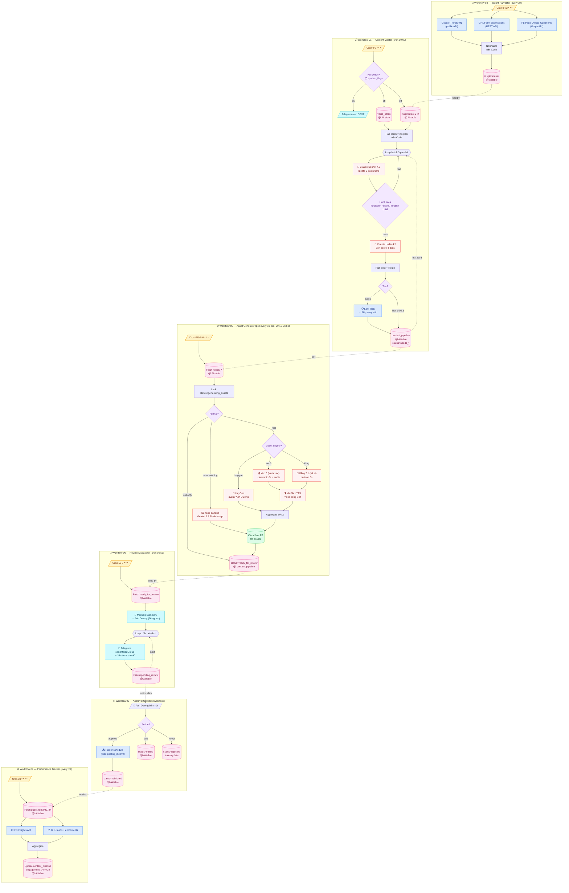
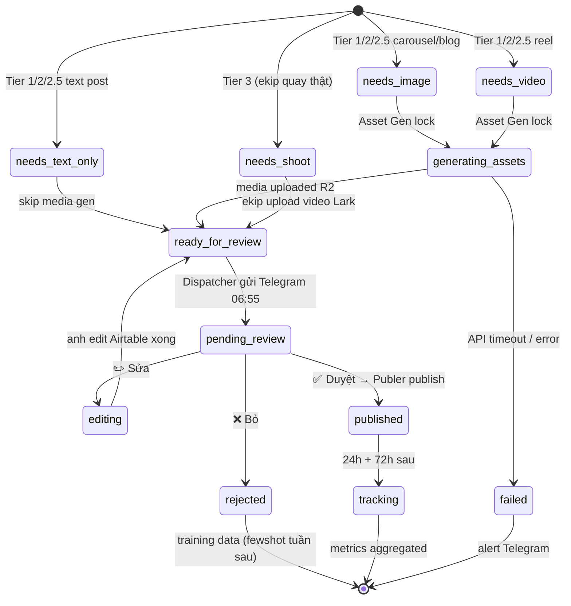
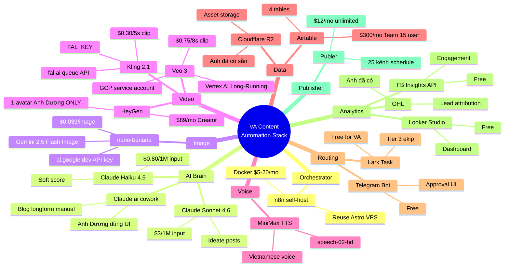
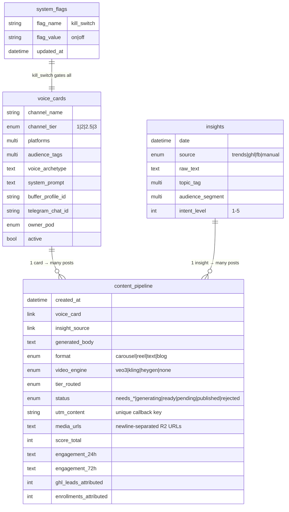
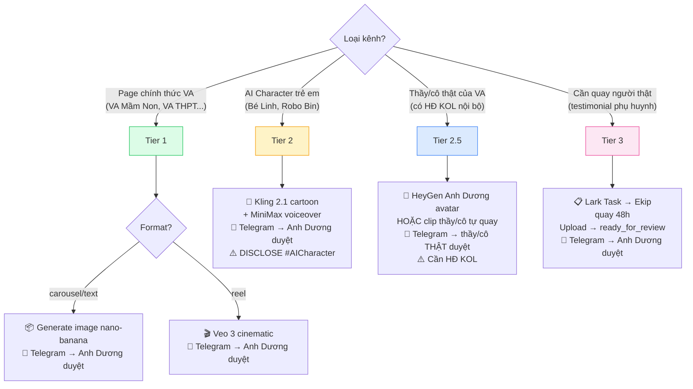
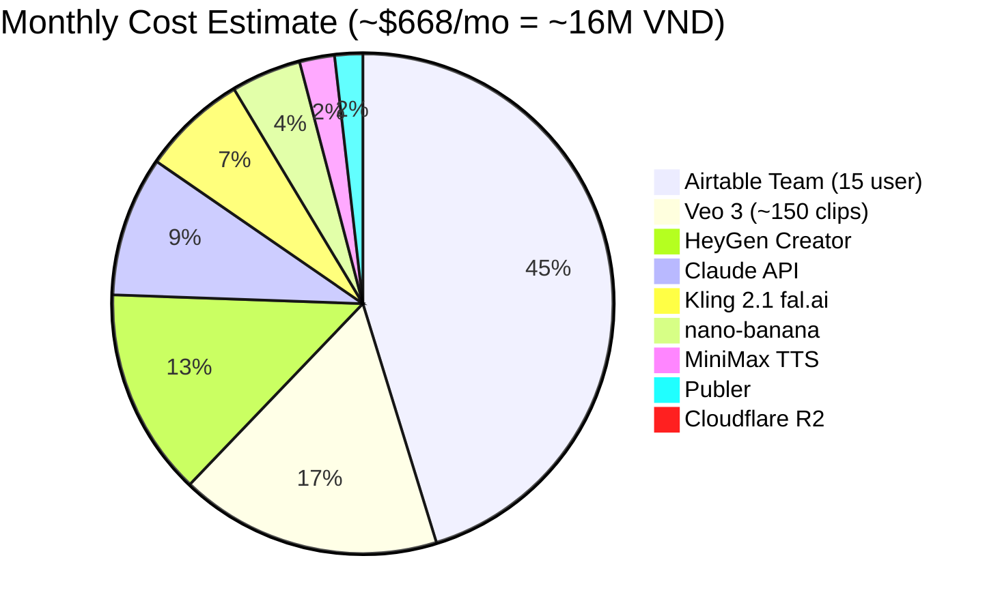

# 🗺 VA Content Automation — Visual Architecture

> Render mermaid diagrams trên: GitHub, GitLab, Notion, Obsidian, hoặc https://mermaid.live

---

## 1️⃣ Master Timeline — 24h Clock

```mermaid
%%{init: {'theme':'base', 'themeVariables': {'fontSize':'14px'}}}%%
gantt
    title VA Content Pipeline — Daily 24h Schedule
    dateFormat HH:mm
    axisFormat %H:%M

    section Workflows
    03 Insight Harvester (every 2h)     :active, ins, 00:00, 24h
    01 Content Master (cron)            :crit, master, 00:00, 25m
    05 Asset Generator (poll every 10m) :crit, asset, 00:10, 6h40m
    06 Review Dispatcher (cron)         :crit, disp, 06:55, 5m
    Anh Dương review (manual)           :review, 07:00, 2h
    02 Approval Callback (webhook)      :active, cb, 07:00, 8h
    04 Performance Tracker (every :30)  :active, track, 00:00, 24h
```

---

## 2️⃣ Macro Flow — 6 Workflows Liên Kết



---

## 3️⃣ State Machine — `content_pipeline.status`



---

## 4️⃣ Tool Reference — Setup Notes



---

## 5️⃣ Data Flow — Airtable Tables Relationships



---

## 6️⃣ Setup Order — Dependency Graph

```mermaid
flowchart LR
    classDef phase1 fill:#fef3c7,stroke:#f59e0b
    classDef phase2 fill:#dbeafe,stroke:#3b82f6
    classDef phase3 fill:#dcfce7,stroke:#22c55e
    classDef phase4 fill:#fce7f3,stroke:#ec4899

    A[1. n8n Docker<br/>self-host]:::phase1 --> B
    B[2. Airtable base<br/>+ 4 tables]:::phase1 --> C
    C[3. Insert kill_switch<br/>= off]:::phase1 --> D

    D[4. Get credentials<br/>18 API keys]:::phase2 --> E
    E[5. .env file<br/>+ docker --env-file]:::phase2 --> F

    F[6. Write 25 voice_cards<br/>system_prompts]:::phase3 --> G
    G[7. HeyGen avatar setup<br/>+ MiniMax voice clone]:::phase3 --> H

    H[8. Import 6 workflows<br/>theo thứ tự]:::phase4 --> I
    I[9. Smoke test manual<br/>1 voice_card]:::phase4 --> J
    J[10. Activate all<br/>cron starts 00:00]:::phase4
```



**Thứ tự import 6 workflows trong n8n:**

| # | File | Khi nào activate |
|---|------|-----------------|
| 1 | `03-insight-harvester.json` | NGAY — cần insight data trước |
| 2 | `01-content-master.json` | Sau khi có 25 voice_cards + insights |
| 3 | `05-asset-generator.json` | Sau khi credentials Veo/Kling/HeyGen OK |
| 4 | `06-review-dispatcher.json` | Cùng lúc 05 |
| 5 | `02-approval-callback.json` | Config Telegram bot credential trong n8n trước |
| 6 | `04-performance-tracker.json` | Sau lần publish đầu tiên |

---

## 7️⃣ Per-Tier Decision Tree



---

## 8️⃣ Cost Breakdown Visual



---

## 9️⃣ KPI Bắc Đẩu — Attribution Chain

```mermaid
flowchart LR
    classDef step fill:#dbeafe,stroke:#3b82f6
    classDef metric fill:#fef3c7,stroke:#f59e0b

    A[Post published<br/>Publer/manual]:::step
    M1[Impressions<br/>+ Engagement]:::metric
    B[Click UTM]:::step
    M2[CTR]:::metric
    C[Landing page<br/>view]:::step
    M3[Bounce rate]:::metric
    D[Form submit<br/>→ GHL contact]:::step
    M4[CPL]:::metric
    E[Meeting booked]:::step
    M5[MQL→SQL rate]:::metric
    F[Enrollment đăng ký]:::step
    M6[⭐ CPE-C<br/>Bắc Đẩu]:::metric

    A --> M1 --> B --> M2 --> C --> M3 --> D --> M4 --> E --> M5 --> F --> M6
```



---

## 🔧 Legend

| Symbol | Meaning |
|--------|---------|
| 🕛 `/Cron .../` | n8n scheduleTrigger node |
| 🤖 | Claude / AI model call |
| 🎬 🎨 👤 | Video generation engines |
| 🖼 🎙 | Image / Voice generation |
| 📦 Airtable | Database operation |
| 📱 Telegram | Notification/approval UI |
| 📋 Lark | Ekip task |
| 📤 Publer | Publish to social channels |
| 📈 💰 | Analytics data sources |
| 💾 R2 | Cloudflare R2 asset storage |
| {decision} | Branching logic |
| -.-> | Polling / async data dependency |
